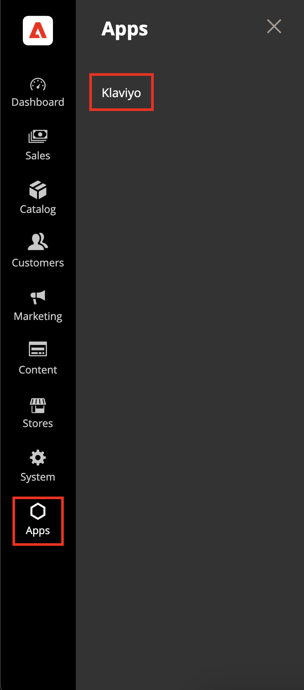

# Installation and Setup

This guide explains how to install, configure, and deploy this Klaviyo App Builder project using our repository structure.

## 1) Prerequisites
- Node.js 22.x (nvm recommended)
- Adobe I/O CLI: `npm i -g @adobe/aio-cli`
- API Mesh plugin (optional): `aio plugins:install @adobe/aio-cli-plugin-api-mesh`
- Access to Adobe Developer Console (Org → Project → Workspace)
- Adobe Commerce instance (SaaS or PaaS) with API access
- Admin UI SDK 3.x.x or higher
  - For PaaS: Follow the [Admin UI SDK installation guide](https://developer.adobe.com/commerce/extensibility/admin-ui-sdk/installation/)
- For Adobe Commerce 2.4.5 on PaaS: [Commerce eventing modules must be installed](https://developer.adobe.com/commerce/extensibility/events/installation/#install-adobe-io-modules-on-commerce)
- Klaviyo Private API Key and API Revision

## 2) Download and bootstrap
Download the app zip file from Adobe Commerce Marketplace (Exchange) and extract it, or clone from the repository if available:
```bash
# If downloading from Exchange:
unzip app.zip into klaviyo-app-builder folder
cd klaviyo-app-builder

# Or if cloning from repository:
git clone <repo-url>
cd klaviyo-app-builder

# Copy environment template
cp env.dist .env
```

## Setting up aio CLI and API mesh plugin
```bash
npm install -g @adobe/aio-cli 
aio plugins:install @adobe/aio-cli-plugin-api-mesh  # optional
```

## Enable Admin UI SDK
Enable the Admin UI SDK in your Adobe Commerce instance for both PaaS and SaaS:
1. In your Adobe Commerce Admin, go to **Stores** > **Configuration** > **Advanced** > **Admin** > **Admin App**
2. Set **Enable Admin App** to **Yes**
3. Save the configuration

For detailed configuration, see the [Admin UI SDK General Configuration guide](https://developer.adobe.com/commerce/extensibility/admin-ui-sdk/configuration/#general-configuration).

## Klaviyo account preparation

Follow Klaviyo’s article on [how to create or clone a private API key](https://help.klaviyo.com/hc/en-us/articles/7423954176283) or [find API keys](https://help.klaviyo.com/hc/en-us/articles/115005062267#h_01HRFPP8R1AEVQ744SE33FQTEC) for users with existing keys


Fill `.env` with values (see README for key descriptions). Never commit `.env`.

### Required environment variables (from `.env`)
- Commerce (both flavors)
  - `COMMERCE_BASE_URL`
    - SaaS: base URL usually includes tenantId and should NOT include `/rest`
      - Example: `https://na1-sandbox.api.commerce.adobe.com/[tenant-id]/`
    - PaaS: base URL should end with `/rest/V1`
      - Example: `https://[environment-name].us-4.magentosite.cloud/rest/V1`
  - `COMMERCE_ADOBE_IO_EVENTS_MERCHANT_ID` - Your Adobe Commerce merchant/organization ID
  - `IO_CONSUMER_ID` - I/O Events consumer ID from Adobe Developer Console
  - `IO_PROJECT_ID` - App Builder project ID from Adobe Developer Console
  - `IO_WORKSPACE_ID` - App Builder workspace ID from Adobe Developer Console
- SaaS (Adobe Commerce as a Cloud Service) – IMS OAuth (required for SaaS)
  - `OAUTH_CLIENT_ID`
  - `OAUTH_CLIENT_SECRET`
  - `OAUTH_TECHNICAL_ACCOUNT_ID`
  - `OAUTH_TECHNICAL_ACCOUNT_EMAIL`
  - `OAUTH_ORG_ID`, `OAUTH_SCOPES`
  - Optional: `OAUTH_BASE_URL`, `OAUTH_HOST`
  - See: [How to get IMS credentials](https://developer.adobe.com/commerce/extensibility/starter-kit/checkout/connect/#adobe-identity-management-service-ims)
- PaaS/On‑Prem (Commerce Cloud/On‑Premise) – Integration OAuth1 (required for PaaS)
  - `COMMERCE_CONSUMER_KEY`
  - `COMMERCE_CONSUMER_SECRET`
  - `COMMERCE_ACCESS_TOKEN`
  - `COMMERCE_ACCESS_TOKEN_SECRET`
  - See: [How to create a Commerce integration](https://developer.adobe.com/commerce/extensibility/starter-kit/checkout/connect/#create-a-commerce-integration)
- Klaviyo
  - `KLAVIYO_API_URL` (default `https://a.klaviyo.com/api`)
  - `KLAVIYO_API_REVISION` (e.g., `2025-07-15`)
  - `KLAVIYO_API_KEY` (private API key)
- Product URLs
  - `ACCS_FE_URL` - Adobe Commerce EDS (Edge Delivery Services) storefront base URL used to build product links for Klaviyo

#### Flavor-specific notes
- SaaS
  - Prefer IMS OAuth (Server-to-Server) credentials from Adobe Developer Console
  - Ensure `COMMERCE_BASE_URL` matches SaaS requirements (no `/rest` suffix)
- PaaS
  - Use Integration credentials from Commerce Admin → System → Integrations
  - Ensure `COMMERCE_BASE_URL` ends with `/rest/V1` for REST operations

## 3) Configure Adobe Developer Console
1. Go to https://developer.adobe.com/console
2. Create Project → App Builder template
3. Select a Workspace (Dev/Staging/Prod)
4. Add services:
   - I/O Events
   - I/O Management API
   - Adobe I/O Events for Adobe Commerce
   - Adobe Commerce as a Cloud Service
   - API Mesh for Adobe Developer App Builder (add localhost:5000 if needed)
5. Download workspace configuration JSON and save to:
   - `scripts/onboarding/config/workspace.json`

## 4) Link local app to Console project
```bash
aio login
aio console org select
aio console project select
aio console workspace select
aio app use
# choose option 'm' (merge) when prompted
```

## 5) Install dependencies
```bash
npm install
# if peer dependency conflicts occur, you may use: npm install --force
```

## 6) Configure API Mesh (optional but recommended)
- Edit `adobe-api/mesh/mesh.json` (e.g., set storefront origin in `meshConfig.responseConfig`).
- First deploy: `aio api-mesh:create adobe-api/mesh/mesh.json`
- Update: `aio api-mesh:update adobe-api/mesh/mesh.json`
- Status: `aio api-mesh:status`

## 7) Deploy runtime actions
```bash
aio app deploy
```
Verify deployments in Adobe Developer Console → Workspace → Runtime.

## 8) Onboarding (providers and registrations)
```bash
npm run onboard
```
Confirm providers/registrations in Adobe Developer Console.

## 9) Subscribe Commerce instance to events
```bash
npm run commerce-event-subscribe
```
This configures Commerce-side event subscriptions using `.env` and `scripts/onboarding/config/*`.

| Entity     | Event Name                                                     | Required Fields                                                                                                                                                                                                      |
|------------| -------------------------------------------------------------- | -------------------------------------------------------------------------------------------------------------------------------------------------------------------------------------------------------------------- |
| Product    | `observer.catalog_product_delete_commit_after`                 | `entity_id`, `sku`, `name`, `created_at`, `updated_at`, `description`                                                                                                                                                |
| Product    | `observer.catalog_product_save_commit_after`                   | `*` (all product attributes)                                                                                                                                                                                         |
| Customer   | `observer.customer_save_commit_after`                          | `id`, `email`, `firstname`, `lastname`, `created_at`, `updated_at`                                                                                                                                                   |
| Order      | `observer.sales_order_save_commit_after`                       | `id`, `entity_id`, `increment_id`, `order_currency_code`, `discount_amount`, `coupon_code`, `customer_email`, `grand_total`, `applied_rule_ids`, `created_at`, `updated_at`, `items`, `addresses`, `state`, `status` |
| Order      | `observer.sales_order_shipment_save_after`                     | `order_id`, `entity_id`, `increment_id`, `order_currency_code`, `discount_amount`, `customer_email`, `grand_total`, `applied_rule_ids`, `created_at`, `updated_at`, `items`, `addresses`, `state`, `status`          |
| Order      | `observer.sales_order_creditmemo_save_after`                   | `order_id`, `entity_id`, `increment_id`, `order_currency_code`, `discount_amount`, `customer_email`, `grand_total`, `applied_rule_ids`, `created_at`, `updated_at`, `items`, `addresses`, `state`, `status`          |
| Sales Rule | `observer.salesrule_rule_save_after`                           | `rule_id`, `name`, `description`, `to_date`, `coupon_type`, `coupon_code`                                                                                                                                            |
| Sales Rule | `observer.salesrule_rule_delete_after`                         | `rule_id`                                                                                                                                                                                                            |
| Sales Rule | `plugin.magento.sales_rule.model.resource_model.coupon.save`   | `coupon_id`, `code`, `rule_id`, `usage_limit`, `times_used`                                                                                                                                                          |
| Sales Rule | `plugin.magento.sales_rule.model.resource_model.coupon.delete` | `coupon_id`, `code`, `rule_id`                                                                                                                                                                                       |


## 10) UI access (backend UI)
App can be accessed through the Experience Cloud Shell link returned after deploying the app or through the admin using the Admin UI SDK. To enable Admin UI SDK in your Commerce instance:

- Navigate to `Stores` → `Settings` → `Configuration` → `Adobe Services` → `Admin UI SDK`
  - Set `Enable Admin UI SDK` to `Yes`
  - Click `Configure Extensions`. Select the workspace of extensions you want to map to the Commerce instance. Click Apply to load the eligible extensions.
    - Workspace choices are: Stage, Production, or Custom. If Custom is selected, be sure to provide the workspace name corresponding to the extension in App Builder. Only English alphanumeric and Latin alphabet characters are allowed.
    - Select the extensions you want to include in the Commerce instance.
  - Save the selection to have registrations correctly included in the Commerce Admin
  - Confirm that the `Apps` → `Klaviyo` section appears on the main menu
    
    

The UI lives in `src/commerce-backend-ui-1/web-src` and is deployed with the actions.

Access options:
- **Dev mode**: `aio app dev`
- **Deployed**: available via the workspace Runtime web URL


## 11) Product catalog sync specifics
- Page/Batch Size controls both fetch size and Klaviyo batch size (max 100; 5MB payload cap).
- Set `ACCS_FE_URL` in `.env` to build product URLs for Klaviyo.

## 12) Storefront Integration Components

To complete the Klaviyo integration for your Adobe Commerce storefront, install the following storefront components. Each repository includes a detailed README with installation and configuration instructions.

### Requirements for Storefront Components:
- An existing Adobe Commerce EDS storefront
- Node.js (v20 or later recommended)
- Access to your storefront's GitHub repository
- Klaviyo Public API Key (different from the Private API Key used in the backend)
- Admin access to configure the components

### Available Components:

- **[Klaviyo Tracking Block for Adobe Commerce Storefront](https://github.com/abovethefray/klaviyo-tracking-block-for-adobe-commerce-storefront)**  
  Enables Klaviyo analytics and tracking on your Adobe Commerce storefront, capturing customer behavior and events.

- **[Klaviyo Checkout Consent Drop-in for Adobe Commerce App](https://github.com/abovethefray/klaviyo-adobe-commerce-app-checkout-consent-dropin)**  
  Provides a checkout consent drop-in component for collecting customer consent to receive marketing communications via Klaviyo.

- **[Klaviyo Signup Block for Adobe Commerce Storefront](https://github.com/abovethefray/klaviyo-signup-block-for-adobe-commerce-storefront)**  
  Adds newsletter signup blocks powered by Klaviyo to your Adobe Commerce storefront, allowing customers to subscribe to marketing lists.

## 13) Troubleshooting
- Timeouts: reduce Page/Batch Size (≤100) and ensure payload < 5MB
- IMS/auth: re-run `aio login` and re-select org/project/workspace
- Commerce API: verify integration credentials and scopes
- API Mesh: validate `mesh.json` and run `aio api-mesh:status`

---
See `README.md` for architecture diagrams, environment variables, and feature overview.
