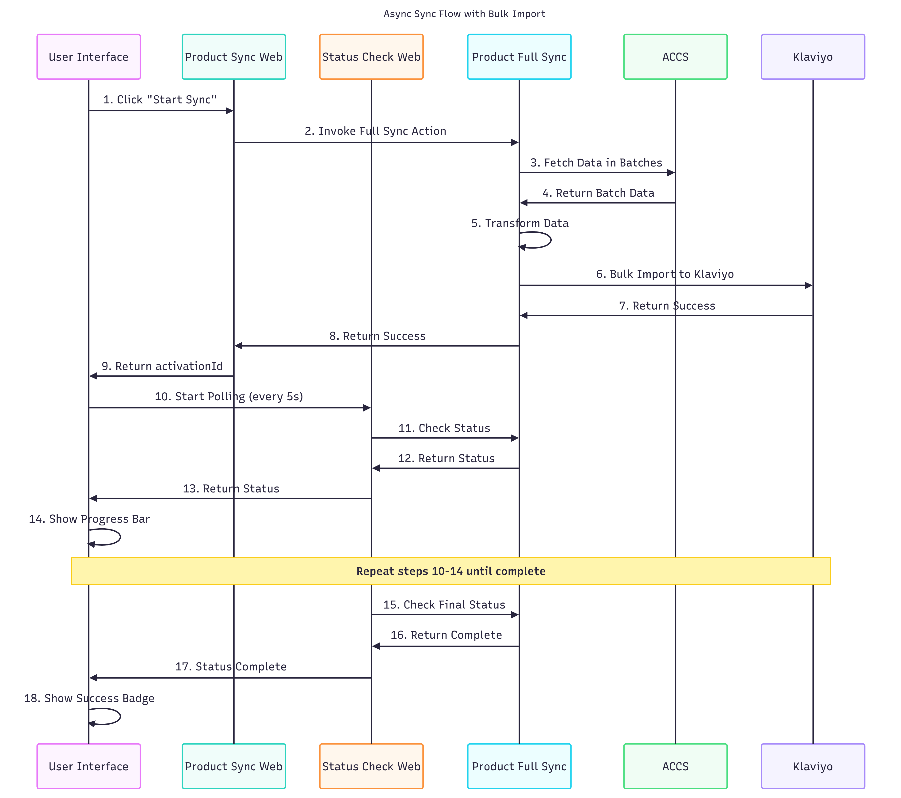
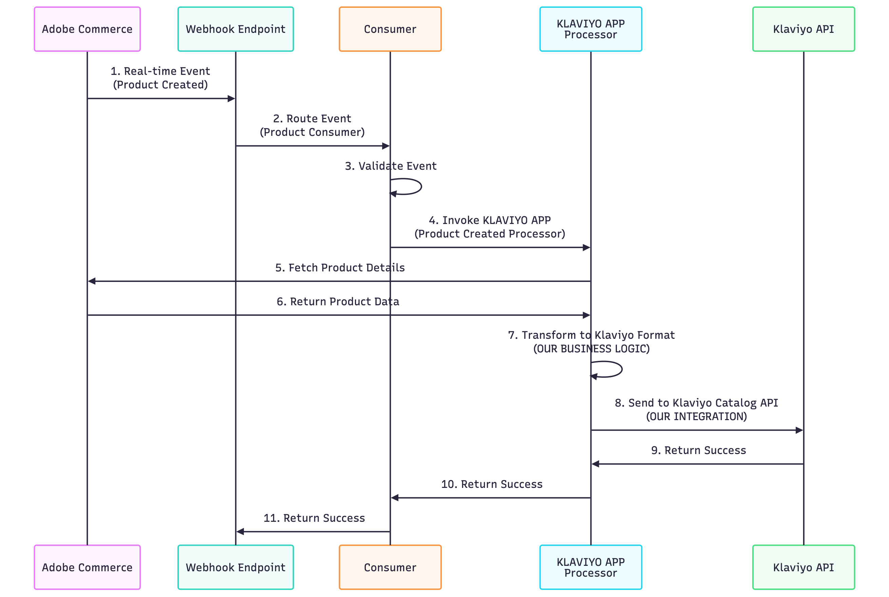

# Adobe Commerce Klaviyo Connector App

A comprehensive Adobe Commerce to Klaviyo integration app that synchronizes customers, products, orders, and sales rules with real-time progress tracking and configurable batch processing. This app also provides storefront integration components for tracking, consent management, and newsletter signups.
## Changelog
### Version 1.0.0
- Initial release
- Customer, Product, Order, and Sales Rule synchronization
- Real-time progress tracking
- Configurable batch processing

For setup and deployment, see [INSTALL.md](INSTALL.md).

## Storefront Integration

This app includes storefront integration components for complete Klaviyo integration on your Adobe Commerce storefront:
- **Klaviyo Tracking** - Customer behavior and event tracking
- **Checkout Consent Drop-in** - Marketing consent collection during checkout
- **Newsletter Signup Blocks** - Klaviyo-powered subscription forms

See [INSTALL.md - Storefront Integration Components](INSTALL.md#12-storefront-integration-components) for installation details and repository links.

## Sync Modes

### Async Mode Full Sync

### Real-time Sync

### Full vs Partial Sync
- Full Sync: processes all entities (customers/products/orders) within the instance. Use when bootstrapping or rehydrating Klaviyo.
- Partial Sync: processes a specific ID range (e.g., Customer ID start/stop) or a selected subset. Use to retry or limit scope.
- Tip: For very large catalogs, prefer partial sync in multiple runs with smaller page/batch sizes to avoid timeouts.

### UI Status Examples

## UI Screens

### Home

- Navigation to Product, Customer, Order, and Sales Rule sync modules.
- From the left navigation, select a sync module.
- Each screen has a Primary action button to start sync and a progress/status area.
- Use smaller page/batch sizes in new environments to avoid timeouts.

### Product Sync

- Page/Batch Size (max 100; 5MB payload note)
- Delete Existing (optional)
- Include Stock Info toggle
- Configurable Product URL template fields
- Live status and timeout guidance

### Customer Sync

- Page Size
- Optional Customer ID range (start/stop)
- Status during sync

### Order Sync

- Page Size
- Status during sync

### Sales Rule Sync

- Page Size
- Status during sync

## Limitations

- Product → Klaviyo Catalog API
    - Max 100 items per request (batch/page size must be ≤ 100)
    - Max payload size 5MB per request
    - Large product images/metadata can increase payload size quickly
    - Long‑running syncs may time out in Runtime; reduce batch size if needed
- General
    - Network/API rate limits from Adobe Commerce or Klaviyo can throttle syncs
    - For SaaS Commerce, prefer IMS (server‑to‑server) auth; for PaaS use Integration OAuth1
